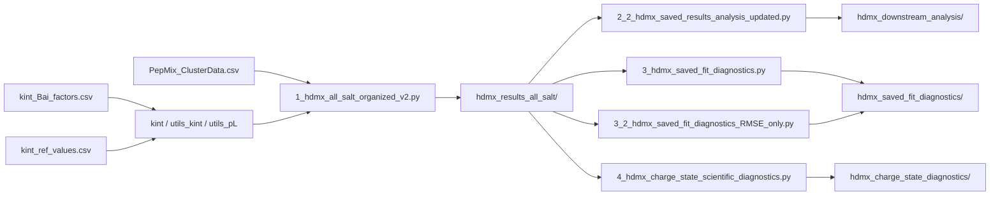

# HDX-MS Mixed-Solvent and Salt-Dependent Analysis Pipeline

This repository contains the Python code used in a thesis project to model and analyze **hydrogen/deuterium exchange mass spectrometry (HDX-MS)** measurements of small peptides across multiple salt conditions and charge states.

The workflow combines:

- experimental deuterium-uptake data;
- residue-specific forward and reverse intrinsic exchange rates in mixed H2O/D2O solvents;
- explicit propagation of deuteration through **labeling, quench, liquid chromatography (LC), and electrospray ionization (ESI)** stages;
- parameter optimization against measured uptake; and
- downstream diagnostics for salt dependence, charge-state dependence, stage-specific deuterium loss, and model error.

> **Note:** `HDMX` is used in several script names as an internal project label. The scientific technique discussed here is HDX-MS.

---

## Repository workflow



The main fitting script is run first. The remaining scripts read the saved outputs and perform downstream analysis **without rerunning the full optimization**, unless explicitly stated otherwise in the code.

---

## Repository contents

| File | Purpose |
|---|---|
| `1_hdmx_all_salt_organized_v2.py` | Main HDX-MS modeling and fitting workflow. Processes all salt/state conditions, calculates intrinsic rates, propagates uptake through labeling → quench → LC → ESI, optimizes model parameters, and saves organized results. |
| `2_1_hdmx_saved_results_analysis.py` | Earlier version of the downstream all-salt analysis. Retained for provenance/comparison. |
| `2_2_hdmx_saved_results_analysis_updated.py` | Updated downstream analysis. Generates cross-salt tables, experimental salt-effect plots, model-validation plots, stage-loss analysis, optimized-parameter comparisons, and residue/rate diagnostics. **Recommended version for routine downstream analysis.** |
| `3_hdmx_saved_fit_diagnostics.py` | Full saved-result fit diagnostics. Calculates RMSE, MAE, bias, R², correlations, exposure-dependent errors, and stage/fit plots. |
| `3_2_hdmx_saved_fit_diagnostics_RMSE_only.py` | Reduced/RMSE-focused fit-diagnostic variant. Use as an alternative to the full diagnostic script when only the simplified error analysis is required. |
| `4_hdmx_charge_state_scientific_diagnostics.py` | Charge-state-focused analysis of experimental/model uptake, stage losses, charge separation, uptake-vs-charge slopes, exposure-dependent errors, and salt dependence. |
| `kint.py` | Command-line interface for calculating residue-specific forward and reverse intrinsic exchange rates. Third-party/upstream component; see [Attribution](#attribution-and-upstream-code). |
| `utils_kint.py` | Intrinsic-rate calculations, reference-rate scaling, sequence corrections, and mixed-solvent rate utilities. Third-party/upstream component. |
| `utils_pL.py` | Effective acidity and isotope-abundance utilities for H2O/D2O mixtures. Third-party/upstream component. |
| `kint_Bai_factors.csv` | Sequence-dependent Bai nearest-neighbor factors used by `utils_kint.py`. Upstream data file. |
| `kint_ref_values.csv` | Reference intrinsic-rate parameters used by `utils_kint.py`. Upstream data file. |
| `PepMix_ClusterData.csv` | Experimental input table used by the thesis workflow. Include this file in a public repository only if its redistribution is permitted. |

---

## Important filename requirement

The analysis code imports:

```python
from utils_kint import calculate_kint
```

and `utils_kint.py` imports `utils_pL.py`. Therefore, the upstream files must have these exact names in the repository:

```text
kint.py
utils_kint.py
utils_pL.py
```

If your local copies are named `kint(1).py`, `utils_kint(1).py`, or `utils_pL(1).py`, **rename them before running or uploading the repository**.

---

## Expected repository layout

```text
.
├── README.md
├── 1_hdmx_all_salt_organized_v2.py
├── 2_1_hdmx_saved_results_analysis.py
├── 2_2_hdmx_saved_results_analysis_updated.py
├── 3_hdmx_saved_fit_diagnostics.py
├── 3_2_hdmx_saved_fit_diagnostics_RMSE_only.py
├── 4_hdmx_charge_state_scientific_diagnostics.py
├── kint.py
├── utils_kint.py
├── utils_pL.py
├── kint_Bai_factors.csv
├── kint_ref_values.csv
└── PepMix_ClusterData.csv
```

Generated result folders do not need to be committed unless they are required for reproducibility or publication archiving.

---

## Requirements

The scripts use Python type syntax that requires **Python 3.10 or newer**.

Core Python dependencies are:

```text
numpy
pandas
scipy
matplotlib
```

A minimal environment can be created with:

```bash
python -m venv .venv
source .venv/bin/activate        # Linux/macOS
# .venv\Scripts\activate       # Windows

python -m pip install --upgrade pip
pip install numpy pandas scipy matplotlib
```

---

## Input data

The main workflow expects `PepMix_ClusterData.csv` in the working directory by default.

The provided dataset contains fields including:

```text
Protein
Start
End
Sequence
Modification
Fragment
MaxUptake
MHP
State
Exposure
File
z
RT
Inten
Center
```

Important conventions in the current implementation:

- `Exposure` is stored in **milliseconds**.
- Salt/experimental conditions are read from the `State` column.
- The supplied dataset includes baseline and NaCl/CsCl conditions such as `0mM`, `150mM_NaCl`, `150mM_CsCl`, `500mM_NaCl`, `500mM_CsCl`, `1M_NaCl`, and `1M_CsCl`.
- Experimental uptake is derived from the measured mass and the undeuterated reference mass (`MHP`).
- The current dataset spans positive labeling times from approximately **50 ms to 300 s**, in addition to zero-exposure reference rows.

---

## Model stages

The main script makes the experimental stages explicit:

```text
Labeling → Quench → LC → ESI → Model/experiment comparison
```

### 1. Labeling

Residue-specific forward and reverse intrinsic exchange rates are calculated using `calculate_kint()` for the labeling temperature, measured pH, and solvent deuterium fraction.

Current defaults in `ExperimentConfig` are:

```text
T_label = 20 °C
pH_read,label = 7.0
D fraction = 0.95
```

### 2. Quench

The deuteration vector is propagated under separate quench conditions using reversible forward/back exchange.

Current defaults are:

```text
T_quench = 0 °C
pH_read,quench = 2.55
D fraction = 0.475
quench time = 180 s
```

### 3. Liquid chromatography

The LC stage applies a time-dependent exchange treatment and fits LC-related parameters to the saved experimental/model framework.

### 4. Electrospray ionization

The final ESI stage models an additional charge-state-dependent change in retained deuteration. In the current optimization configuration, `alpha_ESI` and `xi_ESI` are fixed while `t_ESI` and `lambda_ESI` are fitted.

---

## Running the analysis

Run the scripts from the repository root so that relative file paths resolve correctly.

### Step 1 — Run the main all-salt model

```bash
python 1_hdmx_all_salt_organized_v2.py
```

By default, the script discovers every unique `State` value in `PepMix_ClusterData.csv` and processes the conditions sequentially.

Main output directory:

```text
hdmx_results_all_salt/
```

The root directory contains combined summaries such as:

```text
all_states_fit_metrics.csv
all_states_run_summary.csv
all_states_row_results_scalar.csv
all_states_peptide_parameters.csv
batch_manifest.json
```

Each state also receives its own folder containing scalar/vector result tables, intrinsic-rate tables, optimization outputs, JSON settings, and serialized model objects.

### Step 2 — Run the updated downstream salt analysis

```bash
python 2_2_hdmx_saved_results_analysis_updated.py
```

Output:

```text
hdmx_downstream_analysis/
```

This stage compares salt conditions, generates experimental kinetic plots, model-validation diagnostics, stage-specific losses, parameter trends, intrinsic-rate consistency checks, and selected residue-level diagnostics.

`2_1_hdmx_saved_results_analysis.py` is an earlier version and is not required when the updated script is used.

### Step 3 — Run fit diagnostics

For the full diagnostic analysis:

```bash
python 3_hdmx_saved_fit_diagnostics.py
```

For the simplified/RMSE-focused alternative:

```bash
python 3_2_hdmx_saved_fit_diagnostics_RMSE_only.py
```

Output:

```text
hdmx_saved_fit_diagnostics/
```

These scripts operate on previously saved model results and compare experimental `Uptake` with final modeled `Uptake_ESI`.

### Step 4 — Run charge-state diagnostics

```bash
python 4_hdmx_charge_state_scientific_diagnostics.py
```

Output:

```text
hdmx_charge_state_diagnostics/
```

This analysis includes charge-specific uptake validation, quench/LC/ESI losses, charge-state separation, uptake-vs-charge slopes, error-vs-exposure behavior, and salt-dependent charge-state diagnostics.

---

## Configuration

The main settings are defined near the top of each Python script using dataclasses such as:

```python
ExperimentConfig
OutputConfig
LCParams
LCChemParams
OptimizationConfig
AnalysisConfig
ChargeDiagnosticsConfig
```

Edit these objects rather than changing values throughout the code.

For example, to restrict the main workflow to selected salt states, modify:

```python
states_to_run = None
```

to something such as:

```python
states_to_run = ("0mM", "150mM_NaCl", "150mM_CsCl")
```

### Current labeling-time-offset setting

In the provided version of the main script, the following value is currently present:

```python
tau_label_ms_bounds = (0.0, 0.0)
```

Therefore, the effective labeling-time offset is **fixed at 0 ms** in this version, even though a nearby code comment describes a possible 0–50 ms bound. Change the bounds explicitly if the intention is to fit a non-zero labeling-time offset.

---

## Output organization

The workflow intentionally separates model fitting from downstream scientific analysis.

Typical generated directories are:

```text
hdmx_results_all_salt/
├── 0mM/
├── 150mM_NaCl/
├── 150mM_CsCl/
├── 500mM_NaCl/
├── 500mM_CsCl/
├── 1M_NaCl/
├── 1M_CsCl/
└── combined summary files

hdmx_downstream_analysis/
hdmx_saved_fit_diagnostics/
hdmx_charge_state_diagnostics/
```

The downstream scripts are designed to use the **saved result files**, which makes it possible to regenerate tables and figures without rerunning the expensive model optimization.

---

## Attribution and upstream code

The following files are derived from or taken from the Paci Lab repository **`pacilab/hdx-rates-mixtures`**, with code authored/contributed by **Antonio Grimaldi**:

```text
kint.py
utils_kint.py
utils_pL.py
kint_Bai_factors.csv
kint_ref_values.csv
```

Upstream repository:

https://github.com/pacilab/hdx-rates-mixtures/tree/main/python

The upstream project provides code for calculation of forward and reverse intrinsic amide hydrogen/deuterium exchange rates in mixed H2O/D2O solvents and is distributed under the **MIT License**.

If these upstream files are redistributed in this repository, retain the applicable upstream copyright and license notice. A clean way to do this is to include the original MIT `LICENSE`/notice from the upstream repository or a dedicated `THIRD_PARTY_NOTICES.md` file. Do not imply that the upstream code was authored as part of this thesis.

### Recommended citation for the intrinsic-rate code

> Grimaldi, A., Stofella, M., & Paci, E. (2026). *Intrinsic Hydrogen–Deuterium Exchange Rates in H2O/D2O Mixtures*. **The Journal of Physical Chemistry B, 130**(9), 2493–2500. https://doi.org/10.1021/acs.jpcb.5c06636

BibTeX:

```bibtex
@article{Grimaldi2026IntrinsicRates,
  author  = {Grimaldi, Antonio and Stofella, Michele and Paci, Emanuele},
  title   = {Intrinsic Hydrogen--Deuterium Exchange Rates in H2O/D2O Mixtures},
  journal = {The Journal of Physical Chemistry B},
  year    = {2026},
  volume  = {130},
  number  = {9},
  pages   = {2493--2500},
  doi     = {10.1021/acs.jpcb.5c06636}
}
```

---

## Reproducibility and data-sharing notes

For reproducible thesis results, record the following together with each analysis run:

- Git commit hash;
- Python version;
- package versions;
- exact input CSV version;
- configuration values used for labeling, quench, LC, and ESI;
- selected salt states;
- optimization bounds and fixed parameters.

If `PepMix_ClusterData.csv` contains unpublished, collaborator-owned, or otherwise restricted experimental data, do not place it in a public GitHub repository until data-sharing permission is confirmed. The code can instead document the required schema and point to an external data archive when appropriate.

---

## Suggested `.gitignore`

For a code-focused repository, the following is a useful starting point:

```gitignore
# Python
__pycache__/
*.py[cod]
.venv/
venv/

# IDE / OS
.DS_Store
.vscode/
.idea/

# Generated HDX results
hdmx_results_all_salt/
hdmx_downstream_analysis/
hdmx_saved_fit_diagnostics/
hdmx_charge_state_diagnostics/

# Optional: keep experimental data out of the public repository
# PepMix_ClusterData.csv
```

Remove the generated-output entries if those files are intentionally being versioned for thesis reproducibility.

---

## Research status

This repository contains **research/thesis code**. Model assumptions, fitted parameters, and generated diagnostics should be interpreted in the context of the corresponding thesis methods and results chapters rather than as a general-purpose clinical or production software package.
